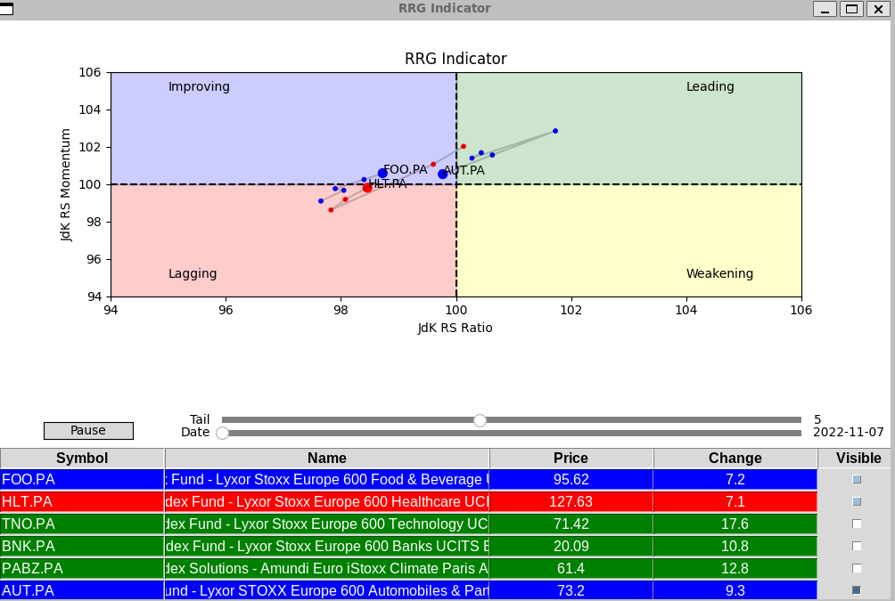

# RRGPy :bar_chart:

This script generates a scatter plot of the JdK RS Ratio vs JdK RS Momentum, known as Relative Rotation Graph, for a set of tickers and displays their current status based on their position in the plot. The RRG (Relative Rotation Graph) Indicator is a visual tool used in technical analysis to identify and compare the relative strength of different assets in a market.

## Requirements

This script requires the following libraries:
    tkinter
    pandas
    numpy
    yfinance
    matplotlib
    scipy

You can install them using pip

    pip install pandas numpy yfinance matplotlib scipy

## Usage

Clone this repository:

    git clone https://github.com/An0n1mity/RRGPy

Open the rrg_indicator.py file and modify the following variables to suit your needs:

- **period**: the period of historical prices to retrieve (e.g., '1y', '3mo', '5d')
- **tickers**: a list of ticker symbols for the assets you want to analyze
- **tail**: the number of historical data points to display as markers (default is 5)
- **tickers_to_show**: a list of ticker symbols to show in the scatter plot (default is all tickers)
- **benchmark**: the benchmark asset to use for comparison (default is '^STOXX')
- **window**: the window size for rolling calculations (default is 14)

Run the script:

    python rrg_indicator.py

The script will generate a scatter plot with the JdK RS Ratio on the x-axis and JdK RS Momentum on the y-axis, as well as a table with the current status of each ticker based on their position in the plot. You can change the ticker by clicking on it in the table.

## Ressources 
- https://marginstone.com/how-to-create-a-relative-rotation-graph-on-excel/
- Book new frontiers in technical analysis: effective tools and strategies for trading and investing paul ciana
